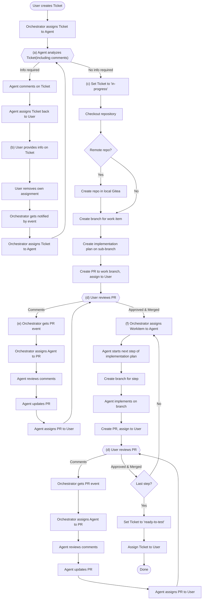

This project should create an environment and orchestration setup for software development by Claude AI.

# The Input

Input to the agents is provided through a ticket system (Taiga). There is a single Taiga project for all agent-managed work. The user creates tickets that are used as input. Tickets require a title and description; agents decide independently whether the description (and any comments) contain sufficient information to begin work.

Agents are notified about new tickets in state "ready" or new input to those tickets via webhooks. Taiga retries failed webhook deliveries; additionally, agents poll for missed events on startup. Whether the webhook listener is a dedicated service or part of the orchestrating agent should be proposed in the implementation plan.

Agents check the tickets, analyze them, and request missing information through markdown-formatted comments (no prefix needed — agents comment under their own identity). Once a ticket contains enough information (agent's judgment), the agents start to work independently and the ticket is moved to "in progress".

Tickets are assigned to agents in FIFO order. The maximum number of agents working on tickets in parallel is configurable. The ticket lifecycle uses three states relevant to agents: **ready**, **in progress**, and **ready for test**. All other states belong to the human user and should be ignored by agents.

# Git Workflow

All work happens in a local Gitea instance. The ticket description must specify the target repository; if it does not, the agent must ask for it via a comment on the ticket.

For new projects, a new repo is created. For existing projects, the repo is checked out. Every work item is done on a dedicated branch with a PR back to the topic branch. Each agent always works on its own branch. Merge conflicts are resolved by the agent that created the PR; if it cannot resolve them, it requests human help via the ticket.

A single ticket can span work across multiple repositories (e.g., a backend API change and a corresponding frontend update). In that case, the implementation plan is created in the "main" repo — the one where most of the work will happen (determined by the agent). The plan outlines steps in other repos as needed. Every PR (including those in secondary repos) contains a link to the ticket and a reference to the relevant step in the plan. If merge ordering between repos matters, the agent either makes this clear in the PR description or creates the PRs sequentially.

The starting point for each ticket is an **Implementation Plan**, submitted as the first PR. The plan is a markdown document with sections and clear steps. Each step represents a feature/function-level increment that can be used on its own; concrete size is proposed by the agent. Steps are sequentially ordered, with parallelizable steps explicitly outlined. If the plan needs revision mid-implementation, the agent creates a new PR with the proposed changes.

The implementation plan PR must be approved by a human before any implementation work begins. Specialized agents may be asked to review and comment on the plan PR, but they cannot approve or merge it.

Each subsequent step of the plan is implemented as an individual PR. When the plan outlines parallelizable steps, the orchestrator spawns multiple agents to work on them simultaneously (if agents of the required specialization are available). The controlling agent reviews each PR and may request changes, but only a human can approve and merge. If a PR is fully rejected, the agent comments on the ticket and only resumes work when new instructions are given there.

All work must include sufficient tests to prevent breaking existing functionality through merges.

Branches are automatically deleted after merge.

When the agent opens the last PR of the implementation plan, the ticket transitions to **ready for test**. If change requests come in on that final PR, they are resolved. Once that PR is merged, the work is finished for the agents. At the transition to "ready for test", the agent adds a comment with release notes to the ticket.

# Work Environment

All work happens inside isolated, ephemeral containers — one container per agent. The container runtime should be fully runnable on a local environment; a local Kubernetes setup (e.g., k3s) is preferred to ease future scaling.

Agents configure the tools they need inside their containers. The typical tool set should be documented in the project for later reuse.

Agents can directly access the internet for read-only access to public services (package registries, documentation, etc.). If feasible, a mirror/proxy solution for package registries should be added to the setup. Agents interact with local services (Gitea, Taiga) under their own identity.

State is transitioned through tickets, the git repository, and potentially a state descriptor file (format to be proposed in the implementation plan). Containers themselves are ephemeral. The whole system must survive full restarts — recovery mechanisms and in-flight work resumption should be proposed in the implementation plan.

Permission/tool-usage policies are human-controlled and their format should be proposed as part of the implementation plan.

Idle agent container lifecycle (destroy immediately vs. keep alive with a timeout) is an implementation decision — a resource-effective approach should be proposed in the implementation plan.

# Agents

A controlling agent orchestrates worker agents to process tickets in parallel. It runs as a supervised process (e.g., Kubernetes deployment or systemd). Whether the orchestrator itself is a Claude AI instance or a traditional service that invokes Claude instances as workers should be proposed in the implementation plan.

The orchestrator is the only component with admin-level access to Gitea and Taiga. Since both services run locally, credential rotation is not required at this stage (potentially in future iterations).

There are two types of worker agents:
- **General-purpose agents** — handle the main implementation work on tickets.
- **Specialized agents** — handle specialized tasks. General-purpose agents delegate to specialized agents by reassigning the ticket to the appropriate Taiga role. The first available agent of that specialization picks up the ticket and reassigns it to its own identity. The requesting agent uses comments to provide instructions to the specialized agent.

Tickets can be multi-assigned to multiple specialized roles in parallel. For example, a general-purpose agent can assign a ticket to both the Frontend and Test roles simultaneously. Agents of both roles pick up the ticket and assign it to themselves, so the ticket is assigned to multiple agents concurrently. Each agent works on its own branch. When each specialized agent finishes, it reassigns the ticket back to the general-purpose agent. The general-purpose agent picks up the ticket once no specialized agents or roles remain assigned — it checks the assignment list before resuming. Whether this check is done by the general-purpose agent or managed by the orchestrator should be proposed in the implementation plan.

When a specialized agent finishes, one of two things happens:
- If the specialized agent completes the full ticket, it transitions the ticket to **ready for test**.
- If the ticket needs further work by the general-purpose agent, the specialized agent reassigns it back to that agent and comments with results.

If a specialized agent determines the delegated work is not needed, it reassigns the ticket back immediately with a comment explaining why. Escalation to the human is triggered after the second reassignment without actual work being done (i.e., two no-op reassignment cycles).

The starting set of specializations (Taiga roles) is: **Frontend**, **Backend**, **Test**, **Documentation**, **Operations**. If additional specializations are required by project needs, the orchestrator defines new roles dynamically.

Agent identities are created automatically by the orchestrating agent, on demand, in both Gitea and Taiga. Agent names include their specialization; the exact naming format should be proposed in the implementation plan. Each agent has its own identity, consistent across Gitea and Taiga, for traceability and correlation.

All permanent errors are escalated to the user via ticket comments. Retry behavior and timeouts are configurable. The human notification mechanism (for escalations, quota warnings, and tickets needing input) should be proposed in the implementation plan, taking into account that the system must work fully locally.

Context preservation across interactions (e.g., between creating a PR and responding to review feedback) should be proposed as part of the implementation plan. Agent failure mid-ticket recovery should also be proposed in the implementation plan.

# Testing and Quality

Agents run tests and linters according to best practices of the technology being used before creating a PR. Testing happens inside the agent's container unless specified otherwise.

CI/CD integration is done via Gitea Actions (GitHub Actions compatible). Agents run tests themselves; Gitea Actions runners are not required immediately but if added should execute in the same environment as the agents, not inside agent containers. Standard CI/CD workflows (test, pre-release, release) are mandatory for all repos and do not need to be outlined in the implementation plan. Only special CI/CD requirements need to be part of the plan.

# Security and Credentials

Git history and ticket history serve as the audit trail; no additional audit logging is needed.

Secret management and least-privilege permission models should be proposed as part of the implementation plan.

# Resource Management

No budget constraints or compute resource limits are enforced. The orchestrating agent should notify the user when a configured quota is reached. Cost tracking is not required at this stage.

# Open Questions

No remaining open questions. All design decisions have been resolved or explicitly deferred to the implementation plan.

## Items Deferred to the Implementation Plan

The following decisions have been explicitly deferred to the implementation plan. They are listed here for completeness so the plan addresses all of them:

1. Webhook listener architecture (dedicated service vs. part of orchestrator)
2. Permission/tool-usage policy format and storage
3. Agent naming convention format
4. Orchestrator nature (AI instance vs. traditional service)
5. Orchestrator recovery mechanism after restart
6. State descriptor file format and storage location
7. In-flight work resumption after system restart
8. Context preservation across agent interactions
9. Secret management approach
10. Least-privilege permission model
11. Human notification mechanism (must work fully locally)
12. Idle agent container lifecycle (resource-effective approach)
13. Agent failure mid-ticket recovery
14. Partial completion coordination (general-purpose agent check vs. orchestrator-managed)

---

## Gap Analysis: Mermaid Diagram vs. Current Implementation

### Legend

- **Implemented** — code exists and is wired up end-to-end
- **Partial** — supporting code exists but is not fully integrated
- **Not implemented** — no working code path

---

### (a) Agent analyzes Ticket (including comments)

**Status: Partial**

The agent *sees* the ticket (subject, description, all comments) because `bootstrap.sh`
(lines 140-160, 310-372) fetches them from Taiga and includes them in the Claude prompt.
However, there is no explicit **analysis step** that decides "info required" vs. "no info
required" before work begins.  The current flow is:

1. Orchestrator assigns ticket and **immediately** sets status to "in progress"
   (`main.go:512-524`).
2. Agent is spawned, receives ticket context, and starts working.
3. If the agent gets stuck, it writes `completion-status.json` with status `"blocked"`,
   and `bootstrap.sh` post-processes this by calling `request_human_input()`
   (bootstrap.sh:428).

**Differences from diagram:**
- The diagram shows the analysis as a synchronous decision gate *before* setting
  "in-progress".  In the current code the ticket is already "in-progress" when the agent
  starts, and the "blocked" path only fires *after* Claude has attempted the work.
- The agent is not explicitly instructed to perform a structured analysis step
  (system-prompt.md does not mention analysing feasibility before implementing).

**Open questions:**
1. Should the agent perform a dedicated analysis phase (e.g. produce an
   `analysis.json` with a go/no-go decision) *before* any implementation, or is the
   existing "blocked" exit sufficient?
**Answer:** It should perform a dedicated analysis
2. Should the ticket stay in "ready" until the agent confirms it can proceed, and only
   then move to "in-progress"?  This would require the orchestrator to wait for the
   agent's analysis result before updating Taiga status.
**Answer:** Yes, it should stay in ready, until the agent declares the information as sufficient
3. If a dedicated analysis step is desired, should it run as a separate short-lived Job
   (fast fail, no repo clone) or as the first phase of the main agent Job?
**Answer:** Yes.

**Follow-up questions (from answers):**
4. The analysis Job is separate and lightweight (no repo clone).  How does it communicate
   its result (proceed / need-info) back to the orchestrator?  Currently Job outcomes are
   detected via K8s Job status polling (Succeeded/Failed every 30s).  Two options:
   - **(A)** The analysis agent posts a machine-readable comment on the Taiga ticket
     (e.g. `[analysis:proceed]` or `[analysis:need-info]`) and the orchestrator parses the
     latest comment after Job completion.
   - **(B)** The analysis agent writes a result file, and `bootstrap.sh` encodes the
     outcome in the Job's exit code (e.g. exit 0 = proceed, exit 42 = need-info).
   Which approach is preferred?
**Answer:** Add it as a comment. This allows to track the history
5. While the ticket stays "ready" during analysis, the orchestrator's reconciliation loop
   (every 30s) re-enqueues all "ready" tickets not tracked by the assignment engine.  To
   prevent a second agent from being spawned for the same ticket, the analysis Job must be
   tracked as an assignment.  This means the assignment engine will mark it as "assigned"
   even though the Taiga status is still "ready".  Is there any concern with that internal
   inconsistency (Taiga says "ready", engine says "assigned")?
**Answer:** The ticket can be assigned to an agent, even if it stays in state ready, no issue with that
6. The analysis Job has no repo clone, but the ticket may reference repos that don't exist
   yet (e.g. `repo: claude/new-service`) or remote repos that haven't been imported.
   Should the analysis agent be able to verify that referenced repos exist (by calling the
   Gitea API), or should it only assess whether the ticket text is sufficiently clear?
**Answer:** The agent need to decide if it requires info from the repo(e.g. do a first analysis of the existing code) or if the ticket is enough. If an existing repo is mentioned, the agent should read and take it into account.

**Follow-up questions (round 3):**
7. Answers 3 and 6+8 are in tension.  Answer 3 says the analysis should run as a
   "separate short-lived Job (fast fail, no repo clone)", but answers 6 and 8 say it
   needs full repo access for a proper evaluation.  A Job that clones a repo is no longer
   short-lived or lightweight.  Two ways to reconcile:
   - **(A)** The analysis Job always clones the repo (if one is referenced).  It is still
     "separate" from the plan-creation Job, but not fast/lightweight.  Analysis and plan
     creation are two sequential full-weight Jobs.
   - **(B)** Merge analysis and plan creation into a single Job.  The agent analyzes the
     ticket and repo, then either requests human info (if unclear) or creates the
     implementation plan (if clear).  This avoids cloning the repo twice.
   Which approach is preferred?
**Answer:** The job can be full-weight. If it should be one or two is an implementational decision. 
8. The analysis agent posts a machine-readable comment (per answer 4).  The orchestrator
   needs to parse this comment after the Job completes.  Should the comment format be a
   simple tag like `[analysis:proceed]` / `[analysis:need-info:<reason>]`, or a more
   structured format (e.g. JSON block in the comment)?
**Answer:** Whatever format is better usable for the orchestrator
9. When the orchestrator picks up a previously analyzed ticket (human added info and
   unassigned), should it always re-run analysis from scratch, or can the agent detect
   that prior analysis comments exist and only re-evaluate the new information?
**Answer:** It should take into account all information, thus run a full analysis. This allows the agent also to detect potential inconsistencies.

*All analysis questions resolved.  No further follow-up needed.*

---

### Comment / AssignUser (Agent requests human input)

**Status: Partial**

`bootstrap.sh` has a `request_human_input()` function (lines 62-108) that posts a comment
on the ticket and optionally reassigns it to the human user (`HUMAN_TAIGA_ID`).  It is
invoked in two cases:

1. No `repo:` line found in the ticket description (bootstrap.sh:196-198).
2. Claude finishes with `"blocked"` status (bootstrap.sh:428).

**Differences from diagram:**
- The diagram shows the agent actively deciding during analysis and commenting.  In
  practice the "blocked" path only triggers after Claude has run and exited, not during a
  pre-implementation analysis.
- The diagram shows the agent assigning the ticket *back to the user*.  The current code
  does reassign via `HUMAN_TAIGA_ID` if that env var is set, which matches.

---

### (b) User provides info / Orchestrator re-assigns

**Status: Implemented (different trigger)**

The orchestrator detects human input via its webhook handler (`main.go:339-346`).
`isHumanInput()` (main.go:369-401) recognises comments, description edits, and
assignment changes from non-agent, non-admin users.

**Differences from diagram:**
- The diagram shows the trigger as: *user removes own assignment* → orchestrator notified
  → re-assign.  The current code triggers on *any* human comment or edit on an
  in-progress ticket, regardless of assignment changes.
- The current code calls `respawnAgent()` (main.go:420-462) which creates an entirely new
  Kubernetes Job.  The diagram implies the same agent instance is re-assigned, but
  creating a new Job is functionally equivalent.

**Open questions:**
1. Should the trigger be strictly "user removes own assignment" (as diagrammed) or "any
   human activity" (as currently implemented)?  The current approach is more permissive —
   a human commenting *without* changing assignment will still re-spawn the agent.
**Answer:** Only respawn if the user removes its assignemnt. That allows the human to add information in multiple steps/comments.
2. The current code has a guard: if the ticket is already assigned to a human, it does
   *not* re-spawn (`main.go:342-344`).  This means the agent is only re-spawned when the
   human takes action but is NOT the current assignee.  Is this intentional?  The diagram
   flow assumes explicit re-assignment.
**Answer:** When human input is required, the ticket should be assigned to the human. As long as a ticket is assigned to the human, nothing should happen.

**Follow-up questions (from answers):**
3. The Taiga webhook payload for assignment changes includes a diff with `from`/`to`
   values and a `By` field showing who triggered the event.  But it does not explicitly
   flag "user removed own assignment" vs. "someone else removed the assignment".  The
   proposed detection: if `By.Username` equals the human user AND
   `assigned_to.from == human_user_id` AND `assigned_to.to == null`, treat it as
   "human unassigned themselves".  Is this heuristic acceptable, or should the user be
   required to take a specific action (e.g. set a tag, change status) instead of relying
   on assignment semantics?
**Answer:** It does not matter who unassigned the human. The orchestrator should pick up the unassigned tickets. 
4. When the agent requests human input, it assigns the ticket to the human and exits.  The
   ticket is still "ready" (per earlier answer) or "in-progress" at that point.  Which
   status should the ticket be in while waiting for human info?  Options:
   - **(A)** Stay in "ready" — but this looks the same as a brand-new unprocessed ticket
     on the Kanban board.
   - **(B)** Move to "in-progress" — the ticket was analyzed, info was asked for, work has
     started conceptually.
   - **(C)** Add a new status like "waiting" — clear distinction, but requires Taiga
     project configuration changes.
**Answer:** Ticket stays in ready. It differes to the "new" tickets, since it is assinged to the human, instead of being unassinged

**Follow-up questions (round 3):**
5. The simplified trigger is: orchestrator picks up any "ready" ticket that is unassigned
   (regardless of who removed the assignment).  But this is also how brand-new tickets are
   detected.  Both cases look identical to the orchestrator: status=ready, assigned=nobody.
   The orchestrator needs to distinguish them because:
   - A **new ticket** should go through analysis from scratch.
   - A **returned ticket** (was analyzed, human provided info, now unassigned) should
     re-analyze with the new context.
   Functionally, "re-analyze" and "analyze from scratch" may be the same Job (the agent
   sees all comments including the prior analysis).  If so, no distinction is needed — the
   orchestrator always runs analysis, and the agent adapts based on comment history.  Is
   that correct, or should the orchestrator treat these cases differently?
**Answer:** The orchestrator should not treat the cases differently. The ticket should always be analyzed in full.

*All human-input questions resolved.  No further follow-up needed.*

---

### (c) Set Ticket to 'in-progress'

**Status: Implemented (different timing)**

Currently the orchestrator sets "in-progress" **at assignment time** (`main.go:516`),
before the agent has started or performed any analysis.

**Difference from diagram:**
- The diagram places this *after* the analysis decision — only when the agent determines
  no info is required.  The current code does it unconditionally on assignment.

**Open question:**
1. If we add a pre-analysis step, the orchestrator would need a new intermediate status
   (e.g. "assigned" or "analyzing") or keep the ticket in "ready" until the agent signals
   it can proceed.  Taiga's status model would need a new column or we leave it in
   "ready" during analysis.  Which approach is preferred?
**Answer:** Ticket should be kept in "ready" until the agent signals that it can proceed

*No follow-up — this is addressed by analysis follow-up question 5 above.*

---

### Checkout / RemoteCheck / CreateGitea / CreateBranch

**Status: Implemented**

`bootstrap.sh` (lines 162-297) handles this correctly:
- Extracts `repo:` lines from the ticket description.
- Detects remote URLs (https/http/git@) and creates a local Gitea repo + imports content
  (lines 199-233).
- For local `owner/name` references, uses them directly.
- Creates a work branch: `agent/{agent-id}/ticket-{id}/work` (or `/step-{n}`).

**Matches diagram:** Yes, this section is consistent.

---

### PlanBranch / PlanPR (Create implementation plan, PR for review)

**Status: Not implemented**

The diagram shows the agent creating an implementation plan on a sub-branch and opening a
PR to the work branch for human review.  This is **not happening**:

- `bootstrap.sh` creates a single branch and hands everything to Claude in one invocation.
  There is no separate plan-creation phase.
- The system prompt (`system-prompt.md`) does not instruct the agent to create an
  implementation plan.
- The orchestrator's `plan` package (`pkg/plan/workflow.go`) can *parse* existing markdown
  plans into steps, but nothing *creates* them or tracks a plan PR.
- The `Plan` struct has a `Phase` field with values like `plan_creation`,
  `awaiting_approval`, `executing` (`plan/workflow.go:27-33`), but these are never set
  during actual execution.

**Open questions:**
1. Who creates the plan — should the agent (Claude) write it during a dedicated first Job,
   or should bootstrap.sh scaffold it?
**Answer:** The agent should write the plan
2. The plan PR targets the "work branch".  Does the work branch serve as the merge target
   for all step PRs as well (i.e. `work` is the integration branch, steps branch off it)?
**Answer:** yes
3. What format should the plan follow?  The parser in `plan/workflow.go:164-210` expects
   `### Step N: Title` headers.  Should we enforce this format in the system prompt?
**Answer:** Yes
4. Should the plan PR be a regular Gitea PR that the user approves via the UI, or should
   there be a Taiga-side approval mechanism?
**Answer:** It should be a regular Gitea PR

**Follow-up questions (from answers):**
5. The current `bootstrap.sh` is a single-mode script.  The new flow requires at least
   four distinct agent modes: **(1)** analysis, **(2)** plan creation, **(3)** step
   implementation, **(4)** PR review-fix.  Should these be:
   - **(A)** Separate scripts (e.g. `analyze.sh`, `plan.sh`, `implement.sh`, `fix-pr.sh`)
     each with its own Dockerfile/image, or
   - **(B)** A single `bootstrap.sh` with a `MODE` environment variable that selects the
     code path (keeps one image, reduces build complexity)?
**Answer:** Implementational decision, up to the implementer
6. The plan agent creates a plan on a sub-branch and opens a PR to the work branch.  The
   plan branch naming convention — should it be something like
   `agent/{id}/ticket-{id}/plan` to distinguish it from step branches?
**Answer:** The agent id does not need to be part of the PR, ticket id an plan/step should be enough
7. After the user merges the plan PR into the work branch, the orchestrator needs to parse
   the plan to know how many steps there are and which are parallel.  This requires the
   orchestrator to **fetch the merged plan file** from Gitea (via the API).  The plan
   parser expects the file at a known path.  Should we mandate that the plan always lives
   at `IMPLEMENTATION_PLAN.md` in the repo root, or allow the agent to choose?
**Answer:** The orchestrator does not need to parse the plan. The plan should be handled by the agent. Agent takes the first step from the plan and starts working. The agent should always have the full plan in mind and have the ability to update the plan(through another PR) if implementation requires changes to the plan. We can delay the parallel work of agents on the same tickets to a later iteration.
8. Does the plan agent also need repo access (clone) to produce a plan that makes sense
   for the codebase?  For example, it may need to see the existing project structure to
   propose meaningful steps.  If so, the plan Job is heavier than the analysis Job — it
   needs a full repo clone.  Is that acceptable?
**Answer:** Yes. The analysis job should also have full access to the repo, in order to do a proper evaluation.

**Follow-up questions (round 3) — agent-driven step management:**

Answer 7 is an important architectural decision: **the agent manages its own step
progression, not the orchestrator.**  This simplifies the orchestrator significantly but
raises several coordination questions.

9. After the agent creates a step PR and exits, the orchestrator detects the Job completed.
   When the human merges the PR, the orchestrator needs to spawn the agent again for the
   next step.  But the orchestrator doesn't parse the plan, so it doesn't know if there
   are more steps.  Two options:
   - **(A)** The agent signals "more steps remaining" vs "last step" in its completion
     comment (e.g. `[step:3/5]` or `[step:complete]`).  The orchestrator reads this and
     decides whether to re-spawn or move to "ready for test".
   - **(B)** The orchestrator always re-spawns the agent after a PR merge.  The agent
     checks the plan and repo state, and if all steps are done, it signals completion
     (e.g. writes `[status:all-steps-complete]`).  The orchestrator then transitions to
     "ready for test".
   Which approach is preferred?
**Answer:** A
10. The agent can update the plan by opening a plan-update PR.  During plan review, step
    execution is paused.  How does the orchestrator distinguish a plan-update PR (wait for
    merge, don't advance steps) from a step PR (merge advances to next step)?
    - **(A)** Naming convention: plan PRs target the work branch with a title/label like
      `[plan-update]`, step PRs have `[step-N]`.
    - **(B)** The agent's completion comment indicates what type of PR was created.
    - **(C)** All PRs to the work branch go through the same review cycle; the orchestrator
      always re-spawns the agent after merge, and the agent decides what to do next.
**Answer:** C
11. Branch naming (per answer 6: `ticket-{id}/plan`, `ticket-{id}/step-{n}`).  The work
    branch itself — should it follow the same convention, e.g. `ticket-{id}/work`?  And
    should the base branch for the work branch always be `main`, or configurable (e.g. a
    specific release branch)?
**Answer:** They should follow teh same convention. The branch should be configurable, but main by default
12. The existing `pkg/plan/` code (plan parser, step tracking, `NextPendingSteps()`,
    `AllStepsCompleted()`) was designed for orchestrator-driven step management.  Since the
    agent now owns step progression, this code is largely unused.  Should we:
    - **(A)** Remove it to avoid confusion.
    - **(B)** Keep it for potential future use (parallel steps, orchestrator-level tracking).
    - **(C)** Repurpose it — e.g. the orchestrator could still parse the plan read-only for
      dashboard/notification purposes without driving step assignment.
**Answer:** Remove it. If some of the code can be reused for other purposes, do so.

**Follow-up questions (round 4):**

Answer 10 (C: orchestrator always re-spawns, agent decides) and answer 9 (A: agent
signals step progress) define a clean protocol between orchestrator and agent.  A few
remaining coordination details:

13. When the orchestrator receives a Gitea PR merge event, it needs to map the PR back to a
    Taiga ticket in order to re-spawn the correct agent.  The PR body already contains a
    ticket link (current bootstrap.sh).  Should the orchestrator:
    - **(A)** Parse the ticket ID from the PR body/title on every PR event (stateless,
      but fragile if the format changes).
    - **(B)** Maintain a mapping of `{repo, PR number} → ticket ID` in its persisted
      state, populated when the agent reports PR creation.
    - **(C)** Both — populate from agent comment, fall back to PR body parsing.
**Answer:** C
14. The base branch for the work branch is configurable (answer 11: "main" by default).
    Where should this be configured?
    - **(A)** In the ticket description (e.g. `base: develop`) — per-ticket flexibility.
    - **(B)** In the orchestrator config (`config.yaml`) — global default.
    - **(C)** Both — ticket overrides global config.
**Answer:** In the ticket. Field should not be required, only used if provided(please document that feature)
15. When the agent is re-spawned after a PR merge, the orchestrator needs to provide enough
    context for the agent to orient itself.  Currently bootstrap.sh receives `TICKET_ID`,
    `PLAN_STEP`, and `REPO_OWNER/REPO_NAME`.  With agent-driven steps, `PLAN_STEP` is no
    longer set by the orchestrator.  Should the orchestrator pass any new context (e.g. the
    last completion comment, the merged PR number), or is the ticket ID + repo sufficient
    for the agent to reconstruct its state from the repo and Taiga comments?
**Answer:** I think ticket and repo should be enough

**Follow-up questions (round 5):**
16. Answer 14 introduces a new `base:` field in the ticket description (optional, alongside
    the existing `repo:` field).  The syntax would be `base: develop`.  When not specified,
    the default is `main`.  Should the agent also validate that the base branch exists in
    the repo during analysis, or just fail at branch creation time if it doesn't?
**Answer:** It should check existence

*All plan/step questions resolved.*

---

### (d) User reviews PR

**Status: Not implemented**

The orchestrator has **no Gitea webhook handler**.  It registers webhooks only for Taiga
(`main.go:680-708`), not for Gitea PR events.

The `review` package (`pkg/review/service.go:55-104`) contains a `ReviewPR()` function
that invokes Claude to review a diff and post a Gitea review, but it is **never called**
from the orchestrator main loop.  Additionally, `getPRDiff()` (line 107) returns a
placeholder string rather than fetching the actual diff.

**What needs to be built:**
1. Register a Gitea webhook (or poll for PR events).
2. Detect PR state changes: new comments, approval, merge.
3. Route events to the appropriate handler.

**Open questions:**
1. Should the orchestrator register a Gitea webhook per-repo (when the agent creates a
   repo) or a global/org-level webhook?
**Answer:** Implementational decision.
2. The Gitea API supports webhook events like `pull_request`, `pull_request_comment`,
   `pull_request_review`.  Which events should trigger agent re-assignment?
**Answer:**  `pull_request_review`
3. Should the orchestrator perform an automated Claude review on every PR before the
   human reviews (as mentioned in README line 181), or only when the human requests it?
**Answer:** Orchestrator should perform an automated review before assigning to the human. But only the human is allowed to approve and merge

**Follow-up questions (from answers):**
4. The diagram and answers define this PR lifecycle for every PR:
   **(1)** Agent creates PR → **(2)** orchestrator auto-reviews via Claude →
   **(3)** orchestrator assigns PR to human → **(4)** human reviews.
   The current Gitea client can set assignees only at PR creation time (no update-assignee
   method).  We need to add `EditPullRequest()` / `SetPRReviewers()` to the Gitea client.
   Also, step (2) uses `pkg/review/service.go` which currently has a placeholder for
   fetching the diff (`getPRDiff()` returns a stub string).  Should the auto-review:
   - **(A)** Post as a `COMMENT` review (informational — the human decides), or
   - **(B)** Post as `REQUEST_CHANGES` if the automated review finds issues (forces the
     human to explicitly override/dismiss)?
**Answer:** It should only comment. The comments should be processed together with the human feedback.
5. For detecting PR merges (which advances to the next step), the orchestrator also needs
   the `pull_request` event (action: `closed` + `merged: true`), not just
   `pull_request_review`.  Should we listen to both `pull_request` (for merge detection)
   and `pull_request_review` (for review-request-changes detection)?
**Answer:** Listen to all required events

**Follow-up questions (round 3):**
6. The auto-review happens between agent PR creation and human review.  How does the
   orchestrator detect that a new PR was created?  Options:
   - **(A)** The agent's completion comment on the Taiga ticket includes the PR number/URL.
     The orchestrator parses this after Job completion and triggers the auto-review.
   - **(B)** A Gitea `pull_request` webhook (action: `opened`) triggers the auto-review
     directly.
   Option (A) ties the review to the Taiga workflow.  Option (B) is more decoupled and
   works even if the agent doesn't post a comment.  Which is preferred?
**Answer:** B

**Follow-up questions (round 4):**
7. The auto-review is triggered by `pull_request:opened`.  The orchestrator then invokes
   Claude to review the diff and posts a `COMMENT` review.  After that, it assigns the PR
   to the human.  But the auto-review is a Claude invocation that takes time (seconds to
   minutes).  During this time:
   - Should the PR be assigned to a "bot" or "review-in-progress" label so the human
     knows not to review yet?
   - Or is it fine for the human to see the PR immediately (the auto-review comments
     arrive later, possibly after the human has started reading)?
**Answer:** Assing the PR to claude(or the agent doing the actual review), since its the one currently reviewing
8. The orchestrator auto-reviews PRs opened on any repo it has a Gitea webhook for.  But
   not all PRs on those repos are agent PRs — the human might open PRs manually too.
   Should the orchestrator auto-review **all** PRs, or only PRs from agent users?  The
   agent PRs can be identified by the author (agent Gitea username) or by a convention in
   the branch name (`ticket-{id}/...`).
**Answer:** Review all

**Follow-up questions (round 5):**
9. The orchestrator auto-reviews all PRs and listens to `pull_request_review` (request
   changes) and `pull_request` (merge) on all watched repos.  For agent-opened PRs, the
   orchestrator maps the PR to a ticket and manages the full lifecycle (re-spawn agent on
   request-changes, advance step on merge).  But for **human-opened PRs** (no ticket
   association): the auto-review makes sense, but the subsequent events
   (request-changes, merge) should be no-ops since there is no ticket to manage.
   Should the orchestrator silently ignore PR events it cannot map to a ticket, or should
   it log a warning?
**Answer:** Just ignore them.

*All PR review questions resolved.*

---

### (e) Orchestrator assigns Agent to PR (comment handling)

**Status: Not implemented**

No code path exists to detect PR comments and spawn an agent to address them.  The
diagram shows: PR event → orchestrator assigns agent → agent reviews comments → updates
PR → assigns PR back to user.

**What needs to be built:**
1. A webhook or polling handler for Gitea PR comment/review events.
2. Logic to spawn an agent Job with context about the PR and review comments.
3. The agent needs to know: which branch, which PR, what comments to address.
4. After the agent pushes, the PR is re-assigned to the human.

**Open questions:**
1. Should the agent receive the full PR diff + review comments, or just the comments?
**Answer:**  full diff and comments
2. How does the agent know which files/lines the comments refer to?  Gitea's PR review
   API includes file paths and line numbers — should bootstrap.sh fetch and format these?
**Answer:**  yes
3. Should this be the same agent (same identity, same Job template) that did the original
   work, or a fresh agent?  Re-using the same agent identity preserves branch ownership.
**Answer:** It should be the same agent
4. When the user adds comments, does the orchestrator wait for all comments (a debounce
   window) or trigger immediately on each comment?
**Answer:** It waits for the review to be finished(e.g. human set "request changes" or "approves and merges")

**Follow-up questions (from answers):**
5. After the agent fixes the PR based on review comments and pushes, the human needs to
   know the PR is ready for re-review.  Should the agent:
   - **(A)** Re-assign the PR to the human user (requires new Gitea client method), or
   - **(B)** Post a comment like "Changes addressed, ready for re-review" (simpler, no
     assignee management), or
   - **(C)** Both?
**Answer:** Both.
6. If the human **approves and merges**, no agent work is needed — the orchestrator should
   advance to the next step (or finish if it was the last).  If the human **closes the PR
   without merging** (rejection), what should happen?  Options:
   - **(A)** Escalate — post a comment on the Taiga ticket, assign to human, pause.
   - **(B)** Treat it as equivalent to "request changes" — re-spawn agent with the
     rejection reason.
   - **(C)** Abort the entire plan — move ticket to a failed/blocked state.
**Answer:** A
7. The PR-fix agent needs to check out the existing branch (not create a new one), address
   the specific review comments, and push.  This is a different mode from "implement a
   step from scratch".  The agent needs as context: the PR diff, all review comments with
   file/line references, and the original ticket/plan context.  Should the orchestrator
   assemble this context and pass it via environment variables, or should `bootstrap.sh`
   fetch it from the Gitea API at runtime?
**Answer:** Implementational decision. Whatever is more appropriate

**Follow-up questions (round 3):**
8. On PR rejection (answer: escalate, pause), the ticket is assigned to the human and
   paused.  To resume, the human would move the ticket back to "ready" and unassign (per
   the ReadyToTest answer 3).  This restarts the full flow from analysis.  But the repo
   still has the work branch with partially merged steps.  Should the new agent:
   - **(A)** Continue from the existing work branch (detect previous work, pick up where
     it left off).
   - **(B)** Start fresh on a new work branch (ignoring previous work).
   - **(C)** The human decides by either keeping or deleting the work branch before
     re-queuing.
**Answer:** C

*All PR-fix questions resolved.  No further follow-up needed.*

---

### (f) Implementation steps — step-by-step execution

**Status: Not implemented (data structures exist)**

The `plan` package has all the necessary data structures:
- `Plan` with `Steps []Step` (`plan/workflow.go:44-52`)
- `NextPendingSteps()` returns the next executable steps (line 64)
- `AllStepsCompleted()` checks if done (line 80)
- Step statuses: pending, in_progress, completed, failed (line 16)

The `assignment` engine tracks `PlanStep` per assignment (`assignment/engine.go:42`).

**But nothing connects them:**
- The orchestrator never calls `NextPendingSteps()`.
- After a PR is merged, nothing advances to the next step.
- No code transitions the ticket to "ready for test" after the last step.
- No code assigns the ticket back to the human at completion.

**What needs to be built:**
1. After plan PR approval: parse the plan, create step entries in state.
2. After each step PR merge: mark step completed, check `AllStepsCompleted()`.
3. If not done: call `NextPendingSteps()` and spawn agent Jobs for them.
4. If done: set ticket to "ready for test", assign to human, post release notes.

**Open questions:**
1. The plan parser supports parallel steps (`plan/workflow.go:178-185`).  Should multiple
   agents work on parallel steps concurrently?  The assignment engine supports this
   (`maxConcurrency`), but each agent would need its own branch.
**Answer:** If the plan explicitly defines the option for parallelism, then yes.
2. How should step PRs be ordered?  If step 3 depends on step 2's changes, the agent for
   step 3 needs step 2's branch merged first.  Should the orchestrator enforce sequential
   merging, or let the user manage merge order?
**Answer:** If steps need to be merged sequentially, they should not be worked on in parallel.
3. Step PRs target the work branch (per the diagram).  After all steps merge into the work
   branch, is there a final PR from the work branch to `main`?  Or does the user handle
   that manually?
**Answer:** There is no final PR from work to main, this is then completely in the hands of the user.

**Follow-up questions (from answers):**
4. For parallel steps, each agent branches off the work branch independently.  If two
   parallel steps modify the same file, a merge conflict will occur when the second PR is
   merged into the work branch.  How should this be handled?
   - **(A)** The orchestrator detects the conflict (Gitea's merge API reports it) and
     re-spawns the conflicting agent with the updated work branch so it can rebase.
   - **(B)** The human resolves the conflict manually.
   - **(C)** The plan format should explicitly declare which files each step touches, and
     the orchestrator prevents parallel execution when file sets overlap.
**Answer:** Disable parallel execution for now. We can come back to that at a later iteration.
5. Each step agent branches off the current work branch head.  For sequential steps, the
   previous step's PR must be merged before the next step starts.  This means the
   orchestrator must wait for each merge event before spawning the next agent.  Is there a
   timeout for how long the orchestrator should wait for the human to review/merge a step
   PR before escalating?
**Answer:** No. no timeout. Thats completely up to the human.
6. If a step agent fails (Job fails, Claude can't complete the task), what happens?
   - **(A)** Retry with the same agent (current `retryLimit` in config).
   - **(B)** Escalate to human immediately (post comment on ticket).
   - **(C)** Skip the step and continue with the next one (risky for dependent steps).
**Answer:** Retry until retryLimit, escalate with a comment after that.

*No additional follow-up — parallel steps deferred, timeout not needed, retry+escalate
is clear.  Step management follow-ups are covered in the PlanBranch section (round 3,
questions 9-12).*

---

### ReadyToTest / FinalAssign / Done

**Status: Not implemented**

No code transitions the ticket to "ready for test" or assigns it back to the human.
`bootstrap.sh` posts a completion comment but does not change ticket status.

The `plan` package has a `completed` phase (`plan/workflow.go:33`) and
`GenerateReleaseNotes()` function (line 92), but neither is called.

**Open questions:**
1. Should release notes be posted as a Taiga comment (as described in README line 169)
   or committed to the repo?
**Answer:** Yes, put them as comment
2. Should the final PR (work branch → main) be created automatically, or is that the
   user's responsibility?
**Answer:** No Pr should be created, responisbility of the user

**Follow-up questions (from answers):**
3. After setting the ticket to "ready for test" and assigning to the human, the ticket's
   lifecycle (from the agent perspective) is done.  But if the human finds issues during
   testing and wants to re-engage the agents, what should they do?
   - **(A)** Move the ticket back to "ready" — the orchestrator treats it as a new ticket
     and starts the full flow again (analysis → plan → steps).
   - **(B)** Add a comment and keep it "in-progress" — the orchestrator detects the
     human's input and re-spawns an agent (similar to the info-request loop).
   - **(C)** Create a new ticket referencing the original.
   This loop is not shown in the diagram — is it intentionally out of scope?
**Answer:** A

**Follow-up questions (round 3):**
4. When the ticket is moved back to "ready", the repo already has the work branch with
   merged steps and possibly a plan file.  The full restart means the agent will re-analyze
   and create a new plan.  Should the agent:
   - **(A)** Create a new work branch (e.g. `ticket-{id}/work-v2`) and new plan, treating
     it as a fresh start while the repo already contains the prior work on `main` or the
     old work branch.
   - **(B)** Reuse the existing work branch, update the plan to address the human's
     feedback (the comments on the ticket will contain the test feedback), and continue.
**Answer:** B
5. Should the release notes comment include a summary of what was implemented (generated
   by the agent) or a mechanical list of merged PRs/steps?
**Answer:** It should include a summary by the agent

*All ReadyToTest questions resolved.  No further follow-up needed.*

---

## Cross-Cutting Follow-Up Questions

These questions arise from combining multiple answers and affect the overall architecture.

### Agent Job Types

The answered questions define four distinct agent activities:

| Mode | Repo clone? | Creates branch? | Creates PR? | Context needed |
|---|---|---|---|---|
| **Analysis** | No | No | No | Ticket text + comments only |
| **Plan creation** | Yes | Yes (plan sub-branch) | Yes (plan PR → work branch) | Ticket + repo structure |
| **Step implementation** | Yes | Yes (step branch off work) | Yes (step PR → work branch) | Ticket + plan + repo |
| **PR review-fix** | Yes | No (reuses existing) | No (pushes to existing PR) | Ticket + plan + PR diff + review comments |

1. Currently `bootstrap.sh` is a single-path script.  Should these become four separate
   scripts (each with a focused system prompt), or one script with a `MODE` env var?  A
   single script with modes is simpler to maintain (one Docker image) but grows complex.
   Separate scripts keep each mode focused but require coordinating shared logic (Taiga
   auth, git config, comment posting).
**Answer:** Implementational decision, unneccessary complexity should be avoided
2. Each mode needs a different system prompt for Claude.  The current
   `agent/system-prompt.md` is generic.  Should we create mode-specific prompts (e.g.
   `system-prompt-analysis.md`, `system-prompt-plan.md`, etc.) or use a single template
   with conditional sections?
**Answer:** Single templates provide more clarity, use single templates

### Gitea Webhook Infrastructure

Multiple parts of the flow depend on Gitea webhook events (plan PR merge, step PR merge,
PR review events).  This is a foundational piece that blocks most of the unimplemented
diagram nodes.

3. The orchestrator currently exposes an HTTP endpoint for Taiga webhooks (port 8080).
   Should Gitea webhooks reuse the same endpoint (with a different path, e.g.
   `/webhooks/gitea`) or a separate port?
**Answer:** Use the same port
4. Gitea webhooks must be registered on each repo the agents work with.  Should the
   orchestrator register the webhook automatically when it first encounters a repo (during
   plan creation), or should `init-gitea.sh` set up a global/org-level webhook that covers
   all repos under the `claude` user?
**Answer:** Implementational decision

### Revised Agent Modes (from answers)

Based on answers (particularly plan Q7, Q8, and analysis Q6), the original four-mode
model has shifted.  Both analysis and plan creation need full repo access, and the agent
(not the orchestrator) manages step progression.  The revised model:

| Mode | What the agent does | Repo? | Output |
|---|---|---|---|
| **Analysis** | Reads ticket + comments + repo, decides proceed/need-info | Yes (clone) | Taiga comment with machine-readable result |
| **Plan + first step** (or just plan) | Creates implementation plan, opens plan PR | Yes (clone) | Plan PR to work branch |
| **Step implementation** | Reads plan from repo, implements next step, opens step PR | Yes (clone, work branch) | Step PR to work branch |
| **PR review-fix** | Addresses review comments on existing PR | Yes (clone, existing branch) | Pushes to existing PR branch |

5. Given that analysis needs a full repo clone (answer 8), analysis and plan creation are
   both full-weight Jobs.  Should we merge them into one Job (the agent analyzes and, if
   clear, immediately creates the plan in the same invocation)?  This avoids two
   sequential repo clones for the same ticket.  The trade-off: if analysis determines
   "need info", the repo clone was wasted.  But clone time is relatively small compared to
   Claude invocation time.  Is merging analysis+plan into one Job acceptable?
**Answer:** Both options are acceptable, implementer can decide. Clone time is so small, that no complexitiy should be added in order to avoid unneccessary clones
6. The "step implementation" and "PR review-fix" modes are similar (both clone, both push).
   The key difference is context: step mode starts from the plan, review-fix mode starts
   from PR review comments.  Should these share a single mode with different context
   injection, or remain separate?
**Answer:** Can be kept seperate for clarity

*All cross-cutting architecture questions resolved.*

---

## Summary of Implementation Gaps

| Diagram Node | Status | Decision (from answers) | Blocking? |
|---|---|---|---|
| Orchestrator assigns Ticket to Agent | Implemented | Keep, but don't set "in-progress" at assignment | Rework |
| (a) Agent analyzes Ticket | Partial | Dedicated full-weight analysis Job with repo access; result as Taiga comment | Yes |
| Agent comments if info required | Partial | Keep `request_human_input`, wire into analysis mode | Yes |
| Agent assigns Ticket back to User | Implemented | Keep; ticket stays "ready", assigned to human | - |
| (b) User provides info / re-assign | Implemented (wrong trigger) | Trigger only on "ticket unassigned" (not any human activity); always full re-analysis | Rework |
| (c) Set to 'in-progress' | Implemented (wrong timing) | Move after analysis confirms "proceed" | Rework |
| Checkout / remote check / create Gitea | Implemented | Keep as-is | - |
| Create branch for work item | Implemented | Branch naming: `ticket-{id}/work`, no agent-id; base branch configurable (default: main) | Rework |
| Create implementation plan on sub-branch | **Not implemented** | Agent writes plan; agent manages steps (not orchestrator); `### Step N` format | Yes |
| Plan PR to work branch | **Not implemented** | Regular Gitea PR | Yes |
| (d) User reviews PR | **Not implemented** | Gitea webhooks (`pull_request` + `pull_request_review`); auto-review as COMMENT; triggered by `pull_request:opened` | Yes |
| (e) Orchestrator assigns Agent to PR | **Not implemented** | Same agent; trigger on `pull_request_review` (request_changes only); agent re-assigns + comments when done | Yes |
| (f) Step-by-step execution | **Not implemented** | Agent-driven; orchestrator re-spawns on every PR merge; agent decides next action; sequential only | Yes |
| Last step check | **Not implemented** | Agent signals `[step:N/M]` or `[step:complete]` in Taiga comment | Yes |
| Set to 'ready-to-test' | **Not implemented** | Orchestrator transitions after agent signals all-complete | Yes |
| Assign Ticket to User (final) | **Not implemented** | Assign to human + post agent-generated release notes summary as Taiga comment | Yes |
| PR rejection | **Not implemented** | Escalate: comment on ticket, assign to human, pause; human decides on work branch (keep/delete) before re-queuing | Yes |
| Re-engagement after test | **Not implemented** | Human moves ticket back to "ready"; agent reuses existing work branch and updates plan | Yes |
| `pkg/plan/` cleanup | Existing dead code | Remove; reuse individual functions if applicable elsewhere | Cleanup |

### Key Architectural Decisions (all confirmed)

1. **Agent-driven step management** — the agent owns the plan and step progression; the
   orchestrator spawns/re-spawns agents but doesn't parse or track the plan.
2. **No parallel steps** (deferred to later iteration).
3. **Analysis needs repo access** — full-weight Job; whether to merge with plan creation is
   an implementational decision (clone overhead is negligible).
4. **Gitea webhooks required** — listen to `pull_request` and `pull_request_review` events
   on the same port (8080) as Taiga webhooks.  Auto-review triggered by `pull_request:opened`.
5. **Ticket stays "ready" during analysis** — moves to "in-progress" only after the agent
   confirms it can proceed.
6. **Uniform ticket handling** — orchestrator treats new and returned tickets identically
   (always full analysis); the agent adapts based on comment history.
7. **Re-engagement = full restart on existing work** — human moves ticket back to "ready";
   agent reuses work branch and updates plan (not fresh start).
8. **PR rejection = escalate** — post Taiga comment, assign to human, pause.  Human decides
   whether to keep or delete work branch before re-queuing.
9. **Separate system prompts per mode** — one focused template file per agent mode.
10. **Step-fix modes kept separate** — step implementation and PR review-fix are distinct
    modes for clarity.
11. **PR-to-ticket mapping** — both: orchestrator state populated from agent comment, falls
    back to PR body parsing.
12. **Base branch** — optional `base:` field in ticket description; default `main`; needs
    documentation alongside `repo:` field.
13. **Minimal re-spawn context** — ticket ID + repo is sufficient; agent reconstructs state
    from repo and Taiga comments.
14. **Auto-review assignment** — PR assigned to reviewing agent/claude during auto-review,
    then reassigned to human after review posts.
15. **Auto-review scope** — all PRs on watched repos (including human-opened PRs);
    silently ignore post-review events for PRs with no ticket mapping.
16. **Base branch validation** — agent checks that `base:` branch exists during analysis.

### All questions resolved. Document is ready for implementation planning.

> TEST with USER_TYPE=ant env set